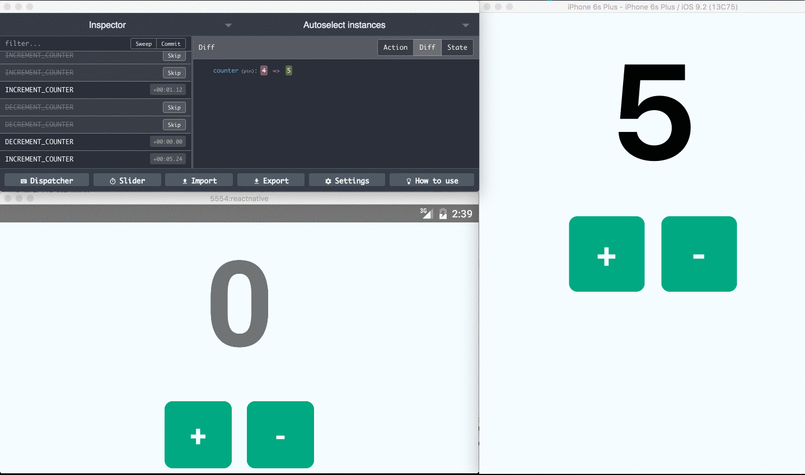

# React Native Hermes Debugger


Use [Redux DevTools](https://github.com/reduxjs/redux-devtools) remotely for React Native with Hermes Engine Enabled.

For those who miss the old `react-native-debugger` (which is being deprecated) that integrated well with Redux DevTools, I've managed to make this work for React Native with Hermes. This solution addresses the lack of support for `await` construction in Hermes and requires some additional configuration.

### Installation

```
yarn add @redux-devtools/remote@github:aliffazfar/redux-devtools
```

```
yarn add react-native-get-random-values
```

```
npx pod-install
```

### Usage

There are 2 ways of usage depending if you're using other store enhancers (middlewares) or not.

The game changer is having this in your redux store config to work with Hermes:
```javascript
if (__DEV__) {
    require('react-native-get-random-values');
}
```

#### Add DevTools enhancer to your store

If you have a basic [store](http://redux.js.org/docs/api/createStore.html) as described in the official [redux-docs](http://redux.js.org/index.html), simply replace:

```javascript
import { createStore } from 'redux';
const store = createStore(reducer);
```

with

```javascript
import { createStore } from 'redux';
import { devToolsEnhancer } from '@redux-devtools/remote';

let enhancers = [];

if (__DEV__) {
  require('react-native-get-random-values');
  enhancers.push(
    devToolsEnhancer({
      name: Platform.OS,
      hostname: Platform.select({ ios: 'localhost', android: '10.0.2.2' }),
      port: 8000,
      secure: false,
      realtime: true,
    })
  );
}

const store = createStore(reducer, devToolsEnhancer());
```

> Note: passing enhancer as last argument requires redux@>=3.1.0

#### When to use DevTools compose helper

If you setup your store with [middlewares and enhancers](http://redux.js.org/docs/api/applyMiddleware.html) like [redux-saga](https://github.com/redux-saga/redux-saga) and similar, it is crucial to use `composeWithDevTools` export. Otherwise, actions dispatched from Redux DevTools will not flow to your middlewares.

In that case change this:

```javascript
import { createStore, applyMiddleware, compose } from 'redux';

const store = createStore(
  reducer,
  preloadedState,
  compose(
    applyMiddleware(...middleware),
    // other store enhancers if any
  ),
);
```

to:


```javascript
import { createStore, applyMiddleware } from 'redux';
import { composeWithDevTools } from '@redux-devtools/remote';

if (__DEV__) {
    require('react-native-get-random-values');
}

const composeEnhancers = composeWithDevTools({
    name: Platform.OS,
    hostname: Platform.select({ ios: 'localhost', android: '10.0.2.2' }),
    port: 8000,
    secure: false,
    realtime: true,
});

const store = createStore(
  reducer,
  /* preloadedState, */ composeEnhancers(
    applyMiddleware(...middleware),
    // other store enhancers if any
  ),
);
```

### Usage

1. Add command to your project's package.json:

```
"scripts": {
  "postinstall": "redux-devtools --port=8000 --open"
}
```
It will be run after yarn | npm install 

or maybe

```
"scripts": {
  "redux-devTools": "redux-devtools --port=8000 --open"
}
```
which you can run later after the app was fully loaded with metro


2. Run the app and connect the devTools with the port that we configure


3. Happy debugging


### Demo



- [Toggle monitoring](http://zalmoxisus.github.io/monitoring/)

  

## Future Improvements

Things to improve:
1. Combine this debugger with Chrome DevTools for the Hermes engine using Electron
   - This enhancement would provide a more comprehensive debugging experience just like old days

2. Find alternative methods for network inspection and integrate them
   - Since network inspection is not possible with Hermes using traditional methods, explore and implement alternative solutions for monitoring network requests and responses


### License

MIT